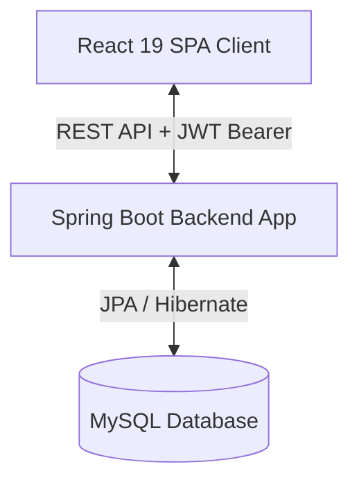

# AURA — Full-Stack Minimalist E-Commerce Platform

A production-ready, full-stack e-commerce project designed with minimalism, speed, and clean code principles in mind. This workspace hosts both the React frontend and the Spring Boot backend services.

---

## 🏗️ Architecture Overview

The system is structured as a decoupled client-server architecture:



### Tech Stack Details
- **Frontend**: React 19 (TypeScript, Vite, fetch-based API services, context-based state management).
- **Backend**: Spring Boot 3.4 (Java 21, Spring Security, Spring Data JPA, JWT Token authentication, Maven).
- **Database**: MySQL.
- **Management Tools**: DBeaver (Database GUI Client).

---

## 📁 Workspace Folder Structure

```
.
├── backend/                  # Spring Boot 3 & Maven source files
│   ├── pom.xml               # Dependencies (Spring Security, JPA, JWT, MySQL)
│   └── src/main/
│       ├── java/             # Main source files (Configs, Controllers, Models, Repos, Security)
│       └── resources/        # Configuration file (application.yml, schema.sql)
│
└── frontend/                 # React 19 & TypeScript SPA source files
    ├── package.json          # Dependency definition
    ├── vite.config.ts        # Vite configuration script
    └── src/                  # Main component modules
        ├── assets/           # React brand assets
        ├── components/       # Reusable layout interfaces
        ├── context/          # Context provider scripts (AuthContext)
        ├── hooks/            # Custom reusable react hooks (useAuth)
        ├── services/         # API fetch calls wrappers
        └── types/            # TypeScript type declaration interfaces
```

---

## 🔒 Security & Authentication (JWT Flow)

The application implements a stateless **JWT (JSON Web Token)** authorization mechanism:

1. **Authentication Process**:
   - The user posts credentials to `/api/auth/signin`.
   - The backend validates the details against MySQL and generates a signed JWT.
   - The token is sent in the response payload and stored in the client's `localStorage`.
2. **Authorized Access**:
   - The client includes the token in the `Authorization` header (`Bearer <token>`) for subsequent requests.
   - The backend's `JwtAuthenticationFilter` intercepts requests, validates the token using the `signingKey`, and configures the Security Context.

```mermaid
sequenceDiagram
    participant Client as React Client
    participant API as Spring Boot Security
    participant DB as MySQL DB

    Client->{API}: POST /api/auth/signin (username, password)
    API->{DB}: Query User details
    DB--{API}: Return User & Roles
    API->{API}: Verify Password & Sign JWT
    API--{Client}: Return JWT Token & User Info
    Note over Client: Stores JWT in LocalStorage
    Client->{API}: GET /api/products (Headers: Authorization: Bearer JWT)
    API->{API}: Validate Token & Authorize Session
    API->{DB}: Query Products
    DB--{API}: Return Products List
    API--{Client}: 200 OK (Products JSON)
```

---

## 🗄️ Database Schema Design (MySQL)

We have designed a production-ready relational schema comprising 12 primary tables, structured with precise keys, constraints, default auditing values, and performant indexes:

### Entity Relationship Diagram
```mermaid
erDiagram
    USERS ||--o{ ADDRESSES : "has"
    USERS ||--o{ ORDERS : "places"
    USERS ||--oO WISHLIST : "likes"
    USERS ||--oO REVIEWS : "writes"
    USERS ||--o| CART : "owns"
    USERS }o--o{ ROLES : "holds"
    
    CATEGORIES ||--o{ PRODUCTS : "contains"
    PRODUCTS ||--o{ CART_ITEMS : "in"
    PRODUCTS ||--o{ ORDER_ITEMS : "in"
    PRODUCTS ||--o{ WISHLIST : "in"
    PRODUCTS ||--o{ REVIEWS : "in"
    
    CART ||--o{ CART_ITEMS : "contains"
    
    ORDERS ||--o{ ORDER_ITEMS : "contains"
    ORDERS ||--o| PAYMENTS : "billed"
    ORDERS }o--|| ADDRESSES : "ships to"
    ORDERS }o--|| ADDRESSES : "bills to"
```

### Table Definitions & Keys

1. **`users`**: Manages customer profiles.
   - PK: `id` (BIGINT AUTO_INCREMENT)
   - Unique constraints on `username` and `email`
   - Fields: `first_name`, `last_name`, `phone_number`, `created_at`, `updated_at`
2. **`roles`**: Defines auth roles (`ROLE_USER`, `ROLE_ADMIN`).
   - PK: `id` (BIGINT AUTO_INCREMENT), Unique: `name`
3. **`user_roles`**: Join table for user-role associations.
   - PK: `(user_id, role_id)`, FKs referencing `users(id)` and `roles(id)`
4. **`categories`**: Grouping criteria for e-commerce products.
   - PK: `id` (BIGINT AUTO_INCREMENT), Unique: `name`, `slug`
5. **`products`**: Product inventory.
   - PK: `id` (BIGINT AUTO_INCREMENT), Unique: `slug`
   - FK: `category_id` referencing `categories(id)` (ON DELETE SET NULL)
   - Checks: `price >= 0`, `stock_quantity >= 0`
6. **`addresses`**: User shipping and billing locations.
   - PK: `id` (BIGINT AUTO_INCREMENT)
   - FK: `user_id` referencing `users(id)` (ON DELETE CASCADE)
7. **`cart`**: Shopping cart representing a user session.
   - PK: `id` (BIGINT AUTO_INCREMENT)
   - FK: `user_id` (Unique, One-to-One) referencing `users(id)` (ON DELETE CASCADE)
8. **`cart_items`**: Products held inside a user's active cart.
   - PK: `id` (BIGINT AUTO_INCREMENT)
   - FKs: `cart_id` referencing `cart(id)` (ON DELETE CASCADE) and `product_id` referencing `products(id)` (ON DELETE CASCADE)
   - Unique Constraint: `(cart_id, product_id)`
9. **`orders`**: Checkout records.
   - PK: `id` (BIGINT AUTO_INCREMENT)
   - FKs: `user_id` (ON DELETE CASCADE), `shipping_address_id` (SET NULL), `billing_address_id` (SET NULL)
10. **`order_items`**: Line items snapshot for historical transactions.
    - PK: `id` (BIGINT AUTO_INCREMENT)
    - FKs: `order_id` (ON DELETE CASCADE), `product_id` (ON DELETE RESTRICT)
    - Unique Constraint: `(order_id, product_id)`
11. **`payments`**: Simulated payment transaction logs.
    - PK: `id` (BIGINT AUTO_INCREMENT)
    - FK: `order_id` (Unique, One-to-One) referencing `orders(id)` (ON DELETE CASCADE), Unique: `transaction_id`
12. **`wishlist`**: Saved items.
    - PK: `id` (BIGINT AUTO_INCREMENT)
    - FKs: `user_id` (ON DELETE CASCADE), `product_id` (ON DELETE CASCADE)
    - Unique Constraint: `(user_id, product_id)`
13. **`reviews`**: Ratings and user comments.
    - PK: `id` (BIGINT AUTO_INCREMENT)
    - FKs: `user_id` (ON DELETE CASCADE), `product_id` (ON DELETE CASCADE)
    - Unique Constraint: `(user_id, product_id)` (one review per user per product)
    - Check Constraint: `rating` value must be between `1` and `5`

### ⚡ Optimization Indexes
To maintain performance during heavy query operations, the following indexes are declared in the DDL schema:
- `idx_products_slug` on `products(slug)`
- `idx_products_category` on `products(category_id)`
- `idx_addresses_user` on `addresses(user_id)`
- `idx_cart_items_cart` on `cart_items(cart_id)`
- `idx_orders_user` on `orders(user_id)`
- `idx_order_items_order` on `order_items(order_id)`
- `idx_wishlist_user` on `wishlist(user_id)`
- `idx_reviews_product` on `reviews(product_id)`

---

## 🚀 Getting Started

### Prerequisites
- **Java**: JDK 21
- **Maven**: Apache Maven 3.8+
- **Node.js**: Node 18+ and npm 10+
- **MySQL Server**: Standard database server running on `localhost:3306`

---

### 1. Database Setup (MySQL)
Before running the backend, create the database instance. You can use **DBeaver** or the MySQL CLI:

```sql
CREATE DATABASE IF NOT EXISTS aura_ecommerce CHARACTER SET utf8mb4 COLLATE utf8mb4_unicode_ci;
```

> [!NOTE]
> The backend application.yml is configured with `ddl-auto: update`, meaning Hibernate will automatically generate the required database tables (`users`, `roles`, `user_roles`) upon the first boot.
>
> You can find the raw DDL schema script ready for manual execution inside [schema.sql](backend/src/main/resources/schema.sql).

---

### 2. Running the Backend
Navigate to the backend folder and compile/run the service using Maven:

```bash
cd backend
mvn clean spring-boot:run
```
The server starts on port **8080** by default.

---

### 3. Running the Frontend
Navigate to the frontend folder, install dependencies, and run the development environment:

```bash
cd frontend
npm install
npm run dev
```
The development server launches at [http://localhost:5173](http://localhost:5173).

---

## 📡 API Authentication Endpoints

| Method | Endpoint | Description | Auth Required |
| :--- | :--- | :--- | :--- |
| **POST** | `/api/auth/signup` | Registers a new user account with `ROLE_USER` | None |
| **POST** | `/api/auth/signin` | Authenticates username/password and returns a JWT | None |
